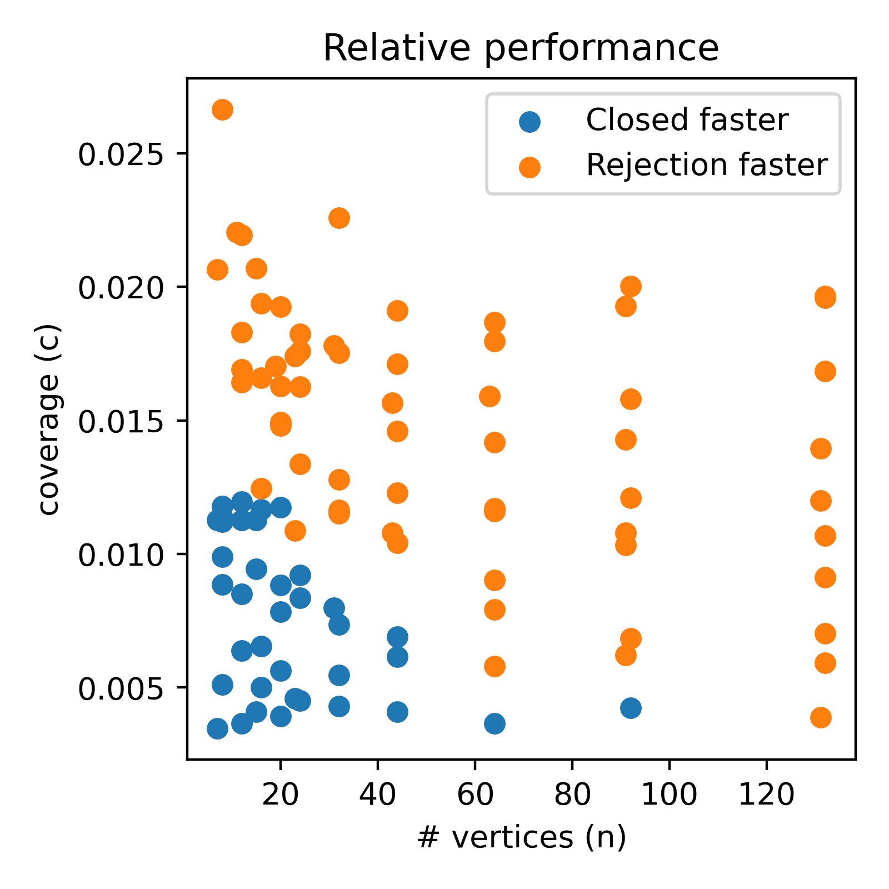

# Sample from Geometry

An algorithm to sample points uniformly in an arbitrary shapely geometry. Depends only on `numpy` and `shapely`. If you want to use it, just copy the `sampling.py` file into your project and use it like this:


```python
from sampling import sample_uniform_from_geom

# A perfect star shape
star = shapely.Polygon([
    [0, 39], [25, 51], [29, 78], [47, 58], [74, 63],
    [61, 39], [74, 15], [47, 20], [29, 0], [25, 28]
])
points = sample_uniform_from_geom(star, 10000)
# A random polygon
geom = shapely.Polygon([
    [16, 16], [57, 79], [77, 25], [127, 44], [180, 26],
    [170, 94], [120, 80], [83, 113], [153, 143], [172, 180],
    [88, 146], [116, 181], [20, 170], [49, 132], [18, 103]
])
points = sample_uniform_from_geom(geom, 10000)
```


Star                                    | Random shape
:--------------------------------------:|:--------------------------------------:
  | 

Works for arbitrarily complex geometries. Both geometries with holes in them, and geometries with thousands of vertices at weird, small angles.

```python
from sampling import sample_uniform_from_geom
from test import complicate_shape

geom = shapely.Polygon([
    [16, 16], [57, 79], [77, 25], [127, 44], [180, 26],
    [170, 94], [120, 80], [83, 113], [153, 143], [172, 180],
    [88, 146], [116, 181], [20, 170], [49, 132], [18, 103]
])
# A polygon with a hole in it
outer = shapely.box(0, 0, 200, 200)
geom_w_hole = shapely.difference(outer, geom)
points = sample_uniform_from_geom(geom_w_hole, 10000)
# A complicated polygon
complicated_geom = complicate_shape(geom, 1)
points = sample_uniform_from_geom(complicated_geom, 50000)
```

Random hole                                | Random complicated geometry
:-----------------------------------------:|:------------------------------------------------:
  | 


## Performance

**tl;dr** `sampling.sample_uniform_from_geom` will probably just use simple rejection sampling, but sometimes can use a clever closed-form solution to make things faster.

### Details

There are two competing algorithms:
1. Closed-form: `sampling.sample_uniform_from_geom_closed` ; see [Closed form algorithm](#closed-form-algorithm) below.
2. Rejection sampling: `sampling.sample_uniform_from_geom_rejection` ; repeatedly sample points, throwing away points outside the geometry until you have enough. (This is what is used by [`geopandas.GeoSeries.sample_points`](https://geopandas.org/en/latest/docs/reference/api/geopandas.GeoSeries.sample_points.html))

I implemented a closed-form solution using scanlines (`sampling.sample_uniform_from_geom_closed`) because rejection sampling seemed wrong to me. The closed-form solution is nice and mathematical and pure. I even solved a simple integral! It scales mostly by number of vertices (roughly O(n log(n))).

In contrast, rejection sampling (`sampling.sample_uniform_from_geom_rejection`) scales up in computation time mostly as a factor of coverage (O(1/c)). E.g. if the geometry covers 50% (c=0.5) of it's bounding box, then rejection sampling takes twice as long as sampling from the bounding box. And if the geometry covers 1% (c=0.01) of the bounding box (e.g. a shapefile of the coastline of a country), then it will take 100x longer.

Due to the relatively large overhead of the scanlines, in most cases using simple rejection sampling is better. But not all. Thus, I performed some experiments and identified a rough relationship to estimate which algorithm will be faster. The default `sampling.sample_uniform_from_geom` implements this to intelligently pick the right algorithm based on workload.



## Closed-form algorithm

1. Calculate the probability density function along one dimension (x)
2. Sample a cdf value and then work out what x gives that cdf value.
3. Sample a y uniformly over all valid y values for that x value.
