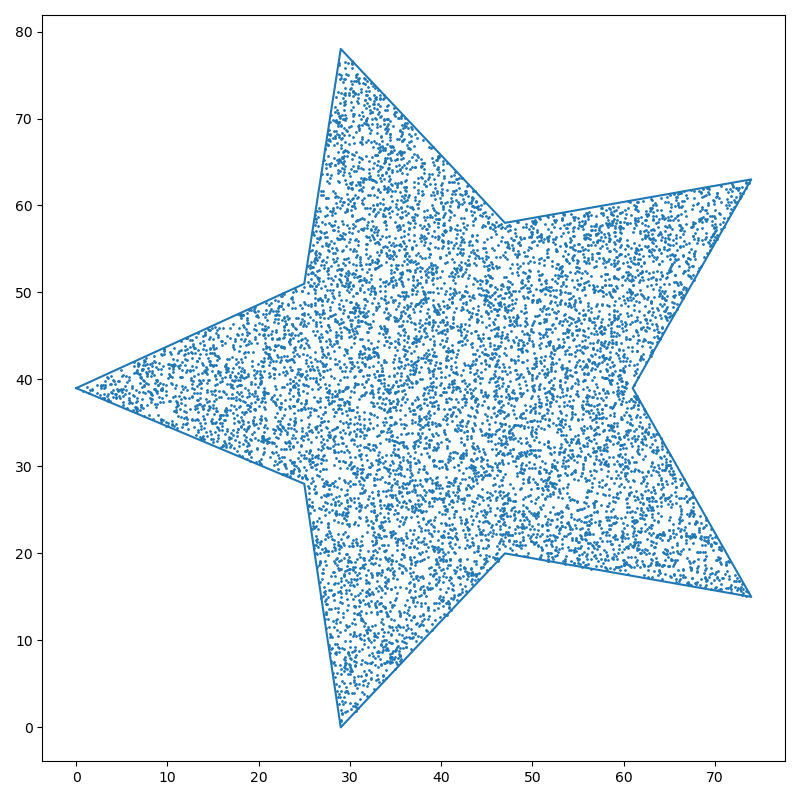
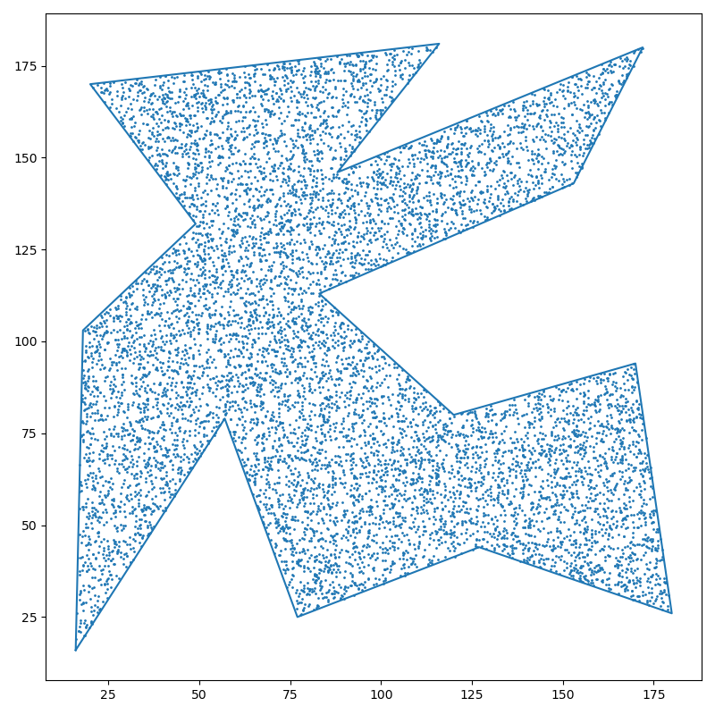
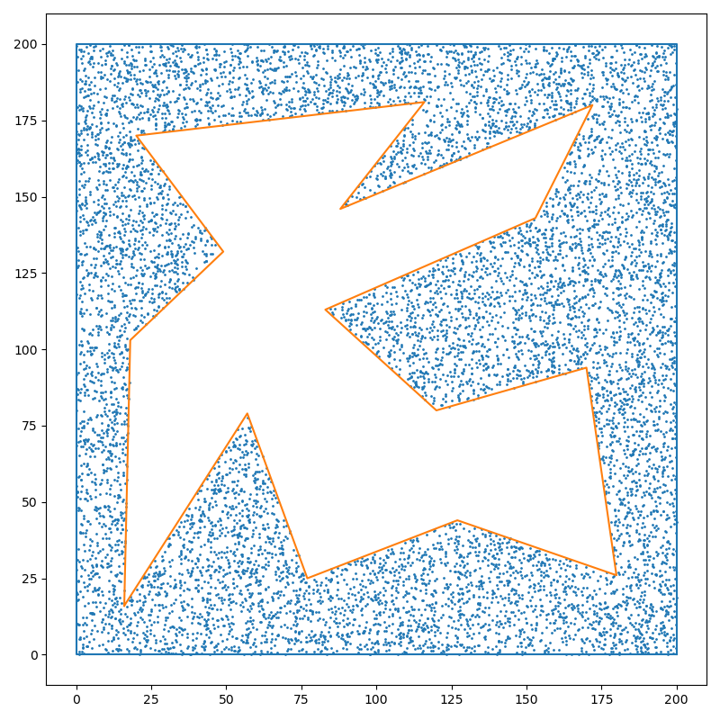
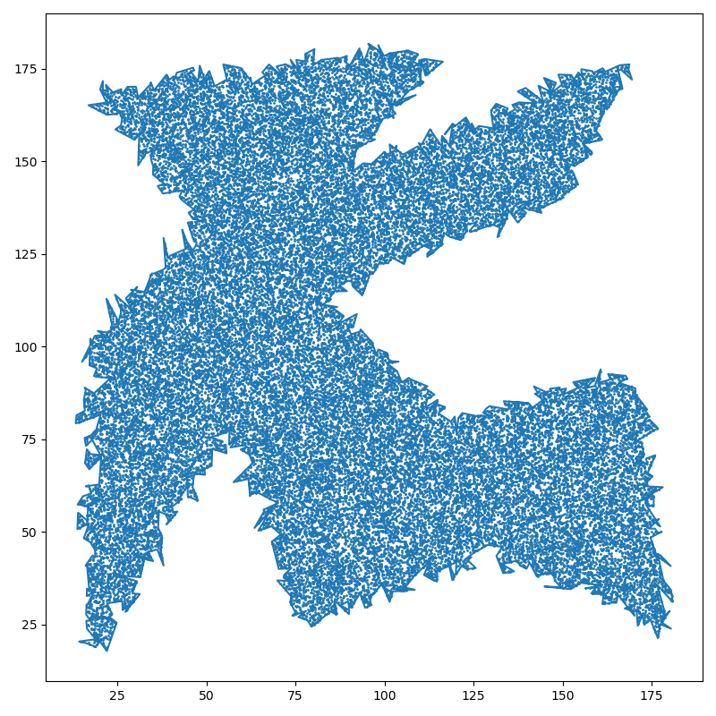
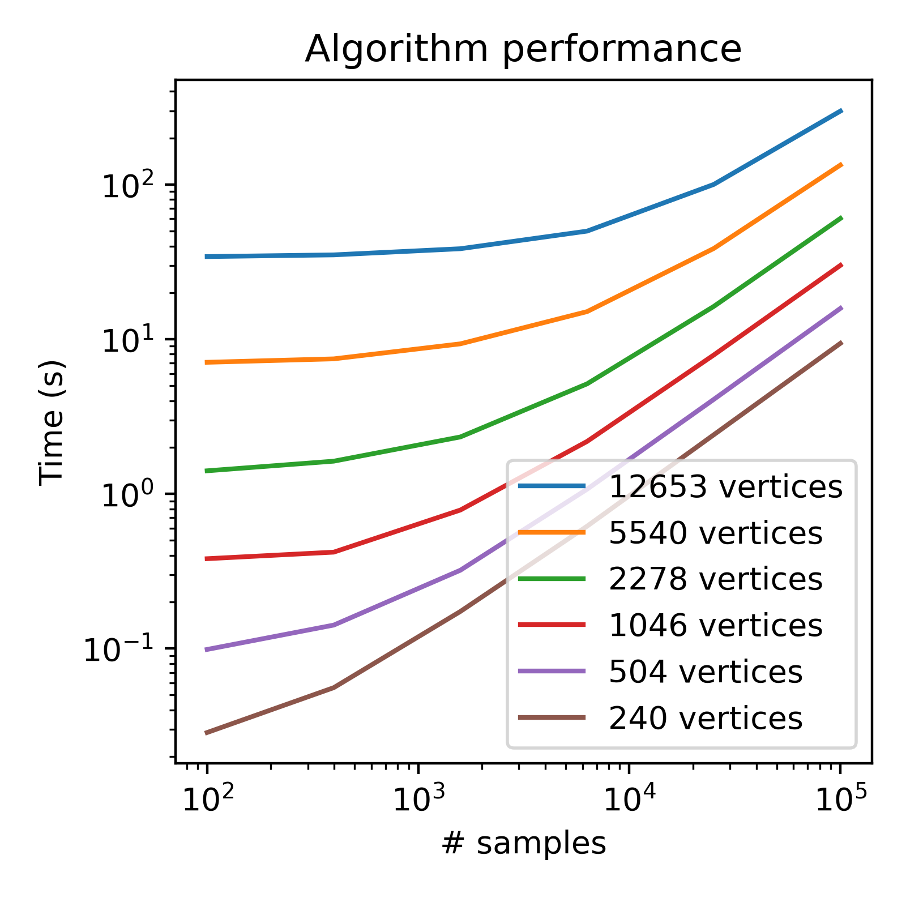

# Sample from Geometry

A standalone algorithm to sample points uniformly in an arbitrary shapely geometry. Depends only on `numpy` and `shapely`. If you want to use it, just copy the `sampling.py` file into your project.

```python
from sampling import sample_uniform_from_geom

# A perfect star shape
star = shapely.Polygon([
    [0, 39], [25, 51], [29, 78], [47, 58], [74, 63],
    [61, 39], [74, 15], [47, 20], [29, 0], [25, 28]
])
points = sample_uniform_from_geom(star, 10000)
# A random polygon
geom = shapely.Polygon([
    [16, 16], [57, 79], [77, 25], [127, 44], [180, 26],
    [170, 94], [120, 80], [83, 113], [153, 143], [172, 180],
    [88, 146], [116, 181], [20, 170], [49, 132], [18, 103]
])
points = sample_uniform_from_geom(geom, 10000)
```


Star                                    | Random shape
:--------------------------------------:|:--------------------------------------:
  | 

Works for arbitrarily complex geometries. Both geometries with holes in them, and geometries with thousands of vertices at weird, small angles. However, it can be a bit slow when the number of vertices gets large (see [Speed](#speed))

```python
from sampling import sample_uniform_from_geom
from test import complicate_shape

geom = shapely.Polygon([
    [16, 16], [57, 79], [77, 25], [127, 44], [180, 26],
    [170, 94], [120, 80], [83, 113], [153, 143], [172, 180],
    [88, 146], [116, 181], [20, 170], [49, 132], [18, 103]
])
# A polygon with a hole in it
outer = shapely.box(0, 0, 200, 200)
geom_w_hole = shapely.difference(outer, geom)
points = sample_uniform_from_geom(geom_w_hole, 10000)
# A complicated polygon
complicated_geom = complicate_shape(geom, 1)
points = sample_uniform_from_geom(complicated_geom, 50000)
```

Random hole                                | Random complicated geometry
:-----------------------------------------:|:------------------------------------------------:
  | 


Caveats:
1. Will sample as if all lines are straight.
2. Doesn't work with invalid geometries.

## Speed

It is not blazingly fast. Most of the algorithm is linear time, but I'm not sure about the underlying shapely code I call. To give a sense of scale, sampling 1000 points from a polygon with 10,000 vertices will take about 30s and requires about 1.5GB of RAM to run. So, consider using [`shapely.simplify`](https://shapely.readthedocs.io/en/latest/reference/shapely.simplify.html) first if you have a lot of vertices.



It was fast enough for what I needed; performance optimisation pull requests welcome.

## Algorithm summary

1. Calculate the probability density function along one dimension (x)
2. Sample a cdf value and then work out what x gives that cdf value.
3. Sample a y uniformly over all valid y values for that x value.
